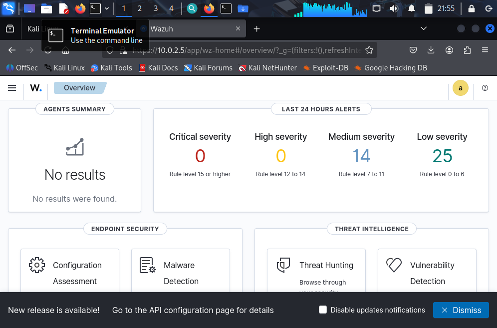
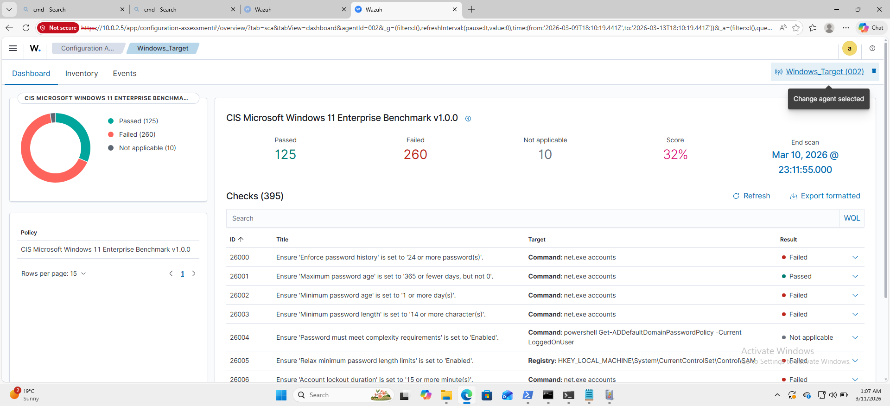
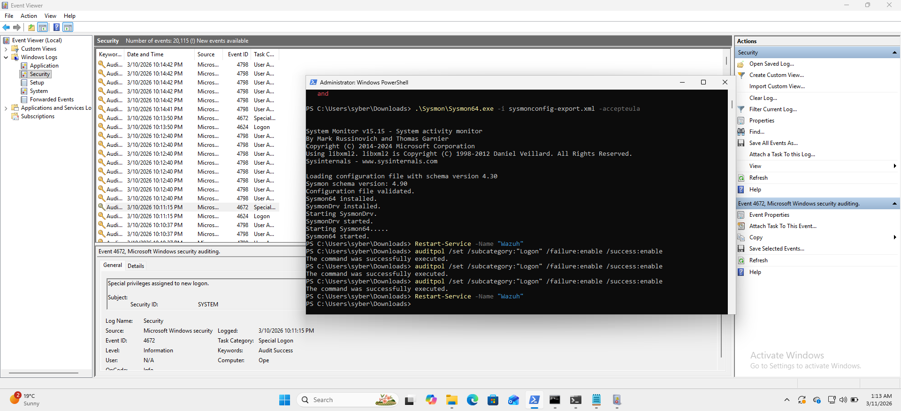
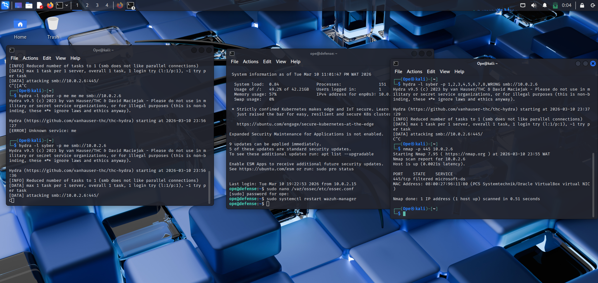
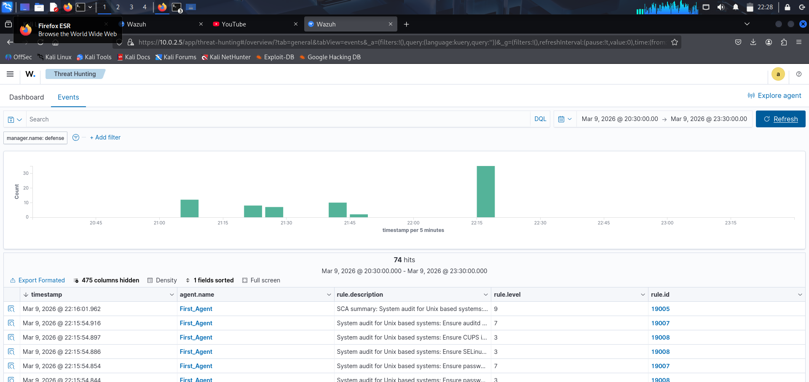

# 🛡️ Building a Professional SOC Home Lab: Wazuh SIEM & Threat Detection

## 🎯 Project Overview
This project documents the end-to-end deployment of a **Security Operations Center (SOC) home lab**. The goal was to establish a centralized monitoring system to detect, analyze, and respond to security threats across a virtualized network. This lab simulates a corporate environment with a SIEM manager, a Linux attack node, and a hardened Windows endpoint.

## 🛠️ Technology Stack
- **SIEM/SOAR**: Wazuh (Indexer, Server, Dashboard)
- **Endpoint Monitoring**: Wazuh Agent, Sysmon (Windows)
- **Virtualization**: Oracle VirtualBox
- **Attack Tools**: Kali Linux (Nmap, Hydra)
- **OS Environment**: Ubuntu Server 24.04 LTS, Windows 11 Home, Kali Linux 2024.x

## 🚀 Key Milestones & "The Win"

### 1. The SIEM "Brain" (Wazuh Manager)
I successfully deployed the Wazuh manager on a resource-constrained Ubuntu Server. I overcame significant hurdles, including:
- **Disk Partitioning**: Expanded a 12GB LVM partition to 50GB to handle high-volume logs.
- **Service Optimization**: Resolved port conflicts (1515/55000) and automated `needrestart` configurations for 24/7 uptime.

### 2. Windows Endpoint "X-Ray" Vision (Sysmon)
I integrated a Windows 11 endpoint with **Sysmon** to achieve deep process-level visibility. 
- **Achievement**: Detected suspicious DLL surrogate injections (`dllhost.exe`) and anomalous service hosts (`svchost.exe`).
- **Audit Compliance**: Performed a **CIS Benchmark** scan (SCA), identifying security misconfigurations against industry standards.

### 3. Automated Incident Response (SOAR)
Configured **Active Response** to move from "Alerting" to "Protecting."
- **Attack Scenario**: A brute-force SMB attack was launched from Kali Linux using Hydra.
- **Response**: Upon detecting **Level 12** authentication failures, Wazuh automatically triggered a firewall block via `netsh.exe`, neutralizing the attack in 60 seconds.

## 📊 Detection Portfolio (Key Alerts)
| Alert Level | Description | Tech Used |
| :--- | :--- | :--- |
| **Level 13** | Brute Force Attack detected on Windows | Wazuh Manager |
| **Level 12** | Suspicious Process (dllhost.exe) detected | Sysmon |
| **Level 3** | New Account Discovery (net.exe) | Windows Security Logs |
| **Active** | Automated Firewall Block (Rule 607) | Active Response |

## 💡 Lessons Learned
- **Persistence is the best tool**: Troubleshooting Hyper-V conflicts and VirtualBox "Critical Errors" taught me more about host-level security than any textbook.
- **Data is king**: A SIEM is only as good as the telemetry it receives; Sysmon is essential for true Windows visibility.

## 🖼️ Technical Gallery (The Journey)

Below is a collection of captures showcasing the evolution of the lab, from initial connectivity tests to full-scale attack simulation and detection.

| Description | Capture |
| :--- | :--- |
| **Initial Kali Scan Verification** |  |
| **Wazuh Agent Deployment Logs** |  |
| **Windows Security Event Ingestion** |  |
| **Sysmon Process Monitoring (Deep Dive)** |  |
| **Active Response Configuration Check** |  |

---
*Developed by Opeyemi Benjamin — aspiring SOC Analyst.*

